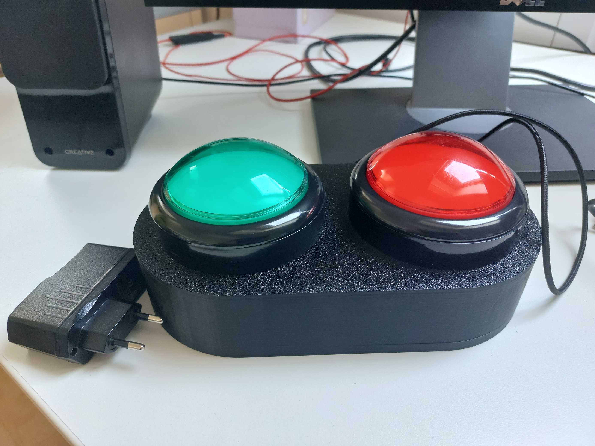
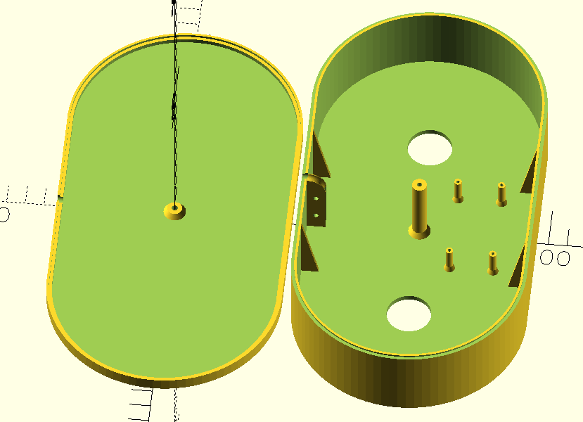

# C0de-Hart

C0de-Hart is a [theater production](https://kopergietery.be/nl/productie/code-%E2%99%A5). [Nerdlab](https://nerdlab.be/) is co-creating an interactive installation for kids accessible to the public (21-25 March 2025, Ghent).

I made 2 props for the installation:

* Two  push button in an enclosure with animated leds when pressed.
* A breathing simulation by inflating/deflating a large plastic bag with 2 PC fans. Speed control is done using PWM. The bag is mounted in a life size figure embodying a Meta Human that can become 'alive' during the installation scenario.

 

# C0de Hart Arduino documentation
## Introduction
Documentation for the ESP32 modules used in the C0de Hart Nerdlab project.

There are 2 modules implemented:

* C0de-hart-buttons
* C0de-hart-Meta-Human-breathing

Both modules use the OSC protocol to communicate with a Touch Designer server.

## Network
This setup is identical for both ESP32 modules.

* SSID:				"Nerdlab"
* Password:			&lt;PASSWORD&gt;
* IP Touch Designer server:	"192.168.188.202"
* Remote Port ESP32:		4401, port to send OSC messages
* Local Port ESP32:		4400, port to receive OSC messages
* Local IP address is allocated via a static IP address configured in the router DHCP setup.
  * C0de-hart-buttons:			"192.168.188.???"
  * C0de-hart-Meta-Human-breathing:	"192.168.188.???"

 

# C0de-hart-buttons

How it looks ...

The OpenScad design

A red and a green push button are used to communicate with the Touch Designer server to indicate if a person in the Meta Human scenario agrees to be uploaded (Green button) or not (Red button).

Receive:

* “/keep_alive”, &lt;integer 0..9999&gt;:
    * No effect, except logging. Optional for Touch Designer server.
    
* “/command”, &lt;ASCII character&gt;:
    * No effect, except logging. 

Send:

* "/keep_alive", &lt;integer 0..9999&gt;:
	* Every 15 seconds
	* Integer is increased by 1 modulo 10000.
	
* “/button”, “red”|”green”:
	* Indicate which button is pressed
	* Every 15 seconds
	* Integer is increased by 1 modulo 10000.
	
 * “/button”, “red”|”green”:
    	* Indicate which button is pressed
 
 

## C0de-hart-Meta-Human-breathing
The Meta Human will start to breath once a person is uploaded after pressing the green button.
Please note the code and hardware used is a reuse/spin-off of the Biomorphic Breath #1 installation created in 2024. More info:

* https://stevevanhoyweghen.github.io/biomorphicbreath1.html
* https://www.instagram.com/p/DCZhbawMvf0/
* https://www.instagram.com/p/DCkP_LMtBDt/
* https://www.instagram.com/p/DCkOsG-MU8e/
* https://www.instagram.com/p/DCcFKGxoJZG/

Only the breathing simulation will be used and will be initiated by Touch Designer by sending “/command”, '1'. To stop send “/command”, '2'.

Receive:

* “/keep_alive”, &lt;integer 0..9999&gt;:
    * No effect, except logging. Optional for Touch Designer server.
* “/command”, &lt;ASCII character&gt;:
      * '0': "Stop all sequence snippets"
      * '1': "Start breathing"
      * '2': "Stop breathing"
      * '3': "Arm left"
      * '4': "Arm right"
      * '5': "Stop arms"
      * '6': "Head"
      * '9': "All together now!"
      * 'a': "Deflate all sequence"
      * 'b': "Inflate all sequence"
      * 'c': "Do nothing, all fans minimal"
      * 'd': "All bags maximum deflation"
      * 'e': "All bags maximum inflation"
      * 'f': "Test sequence"
      * … all others will give a LOG_WARNING, "Unhandled command"

Send:

  * "/keep_alive", &lt;integer 0..9999&gt;:
      * Every 15 seconds
      * Integer is increased by 1 modulo 10000.
  * “/command”,  &lt;copy received command&gt;
